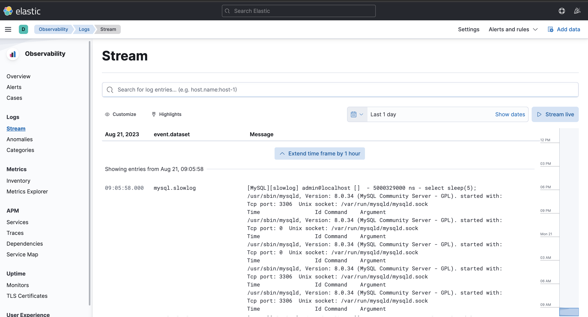
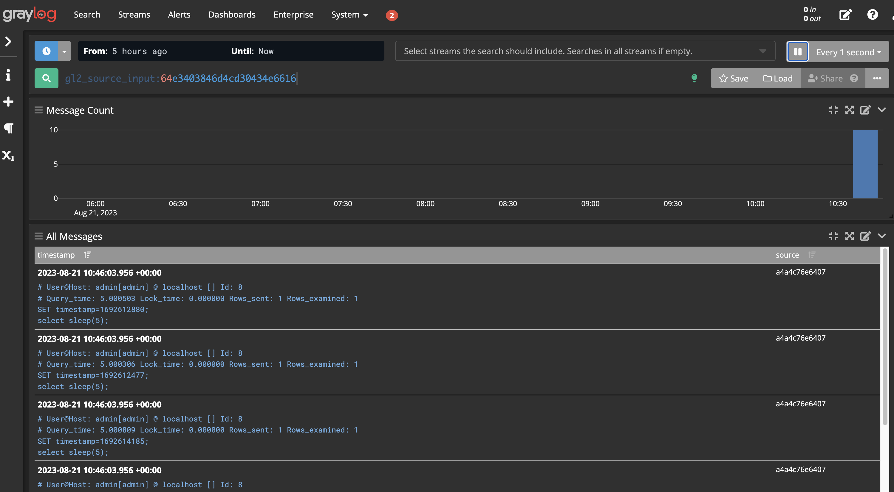

# projector-logging
Sets up logging for MySQL slow query log using ELK stack and GrayLog

# Project Structure
- [config](./config): configuration files for elasticsearch, filebeat, kibana and logstash
- [data](./data): mongodb data for graylog
- [docker compose for ELK](./docker-compose-elk.yaml): docker compose file to test ELK stack
- [docker compose for GrayLog](./docker-compose-graylog.yaml): docker compose file to test GrayLog
- [logs](./logs): MySQL slow query logs

# Run
1. ELK stack
```shell
docker-compose --file ./docker-compose-elk.yaml up -d
```

Execute slow query in mysql:

Connect to mysql container and execute slow query:
```mysql
select sleep(5);
```
Go to `localhost:5600` to see logs in Kibana:


2. GrayLog
```shell
docker-compose --file ./docker-compose-graylog.yaml up -d
```

Execute slow query in mysql:

Connect to mysql container and execute slow query:
```mysql
select sleep(5);
```
Go to `localhost:9000` to see logs in GrayLog:

